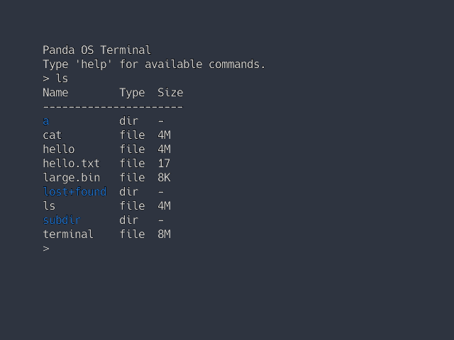

# Panda

A hobby operating system written in Rust, exploring OS design concepts with a focus on rich IPC and structured data pipelines.



## Features

- **UEFI boot** with higher-half kernel
- **Preemptive multitasking** with full context switching
- **Message-passing IPC** with channels (bidirectional, 4KB messages) and mailboxes (event aggregation)
- **Structured pipelines** where tools exchange typed `Value` objects (tables, styled text, etc.) rather than raw bytes
- **Scheme-based resource system** with unified device paths (`keyboard:/pci/input/0`, `block:/pci/storage/0`)
- **Integrated compositing GUI** with virtio-gpu backend
- **Read-only ext2 filesystem** with async I/O

## Building

Requires Rust nightly and QEMU.

```bash
make build    # Build kernel and userspace
make test     # Run all tests
make run      # Run in QEMU
```

See [docs/BUILDING.md](docs/BUILDING.md) for detailed build instructions.

## Project structure

```
panda-kernel/       # Kernel source
panda-abi/          # Shared syscall definitions and types
userspace/libpanda/ # Userspace library
userspace/terminal/ # Terminal emulator
userspace/init/     # Init process
docs/               # Documentation
```

## Documentation

- [BUILDING.md](docs/BUILDING.md) - Build commands and custom targets
- [TESTING.md](docs/TESTING.md) - Writing and running tests
- [SYSCALLS.md](docs/SYSCALLS.md) - Syscall ABI and conventions
- [IPC.md](docs/IPC.md) - Channels, mailboxes, and process communication
- [PIPELINES.md](docs/PIPELINES.md) - Structured Value-based pipelines
- [DEVICE_PATHS.md](docs/DEVICE_PATHS.md) - Unified device path scheme

## Status

This is an early-stage hobby project. It boots, runs programs, and has a working terminal with basic utilities (`ls`, `cat`, `hello`). Contributions and feedback are welcome.

## Licence

This project is licensed under the [Mozilla Public License 2.0](LICENSE).
